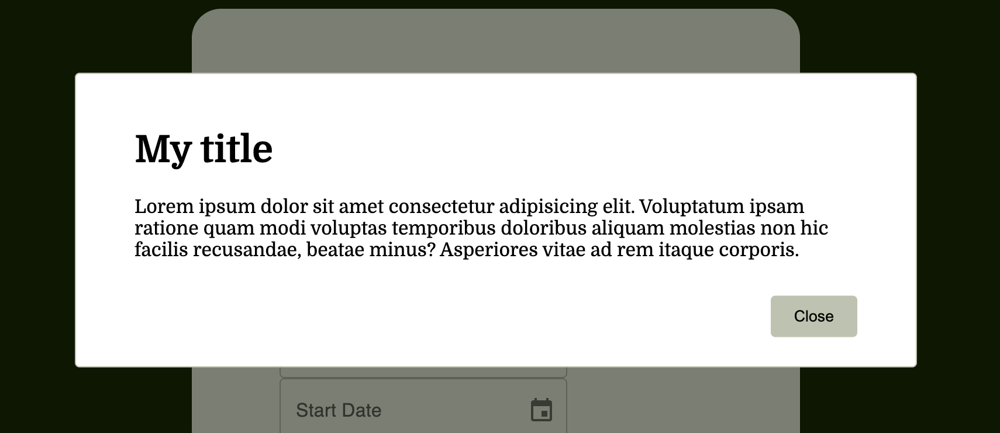
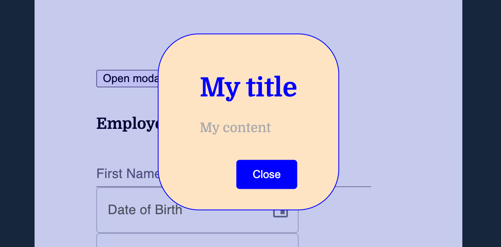
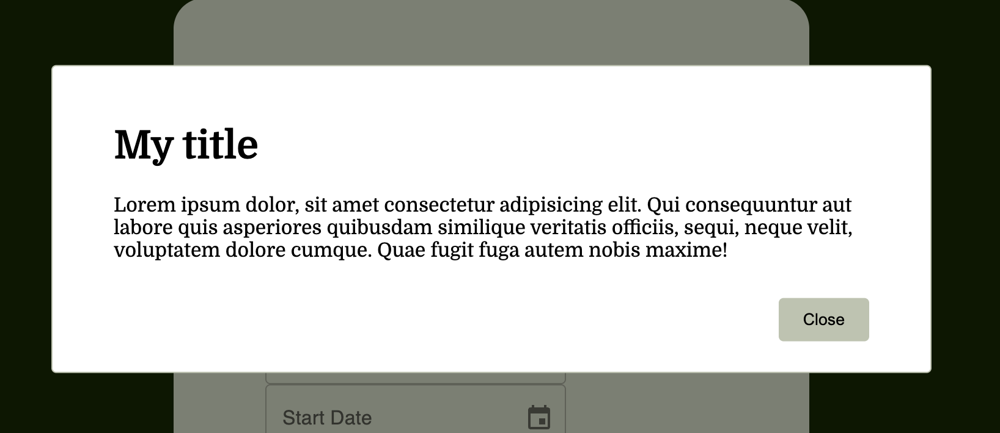
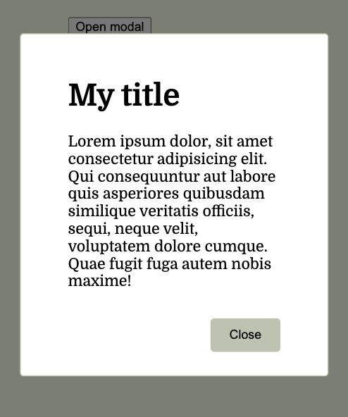

# Modal

A customizable React modal component.



---

## Installation

```bash
npm install componentName
```

or

```bash
pnpm install componentName
```

---

## Basic usage

```jsx
import { useState } from "react";
import Modal from "componentName";

export default function App() {
  const [isModalOpen, setIsModalOpen] = useState(false);

  return (
    <button onClick={() => setIsModalOpen(true)}>Open modal</button>
    <Modal
      title="My title"
      open={isModalOpen}
      onClose={() => setIsModalOpen(false)}
    >
        Lorem ipsum dolor sit amet consectetur adipisicing elit. Voluptatum ipsam ratione quam modi voluptas temporibus doloribus aliquam molestias non hic facilis recusandae, beatae minus? Asperiores vitae ad rem itaque corporis.
    </Modal>
  );
}
```

---

## Props

| Prop                  | Type         | Default | Description                                    |
| --------------------- | ------------ | ------- | ---------------------------------------------- |
| `open`                | `boolean`    | —       | Controls the visibility of the modal           |
| `onClose`             | `() => void` | —       | Callback called when the modal is closed       |
| `title`               | `string`     | —       | Title displayed at the top of the modal        |
| `children`            | `ReactNode`  | —       | Content of the modal                           |
| `closeOnOverlayClick` | `boolean`    | `false` | Closes the modal when clicking outside of it   |
| `closeOnEsc`          | `boolean`    | `false` | Closes the modal when pressing the Escape key  |
| `preventScroll`       | `boolean`    | `false` | Prevents page scrolling when the modal is open |
| `className`           | `string`     | —       | CSS class to customize the modal style         |
| `classNameOverlay`    | `string`     | —       | CSS class to customize the overlay style       |

---

## Examples

### Use `closeOnOverlayClick` props

```jsx
<Modal
  title="My title"
  open={isModalOpen}
  onClose={() => setIsModalOpen(false)}
  closeOnOverlayClick
>
  My content
</Modal>
```

Now I can close the modal by clicking outside of it.

### Use `closeOnEsc` props

```jsx
<Modal
  title="My title"
  open={isModalOpen}
  onClose={() => setIsModalOpen(false)}
  closeOnEsc
>
  My content
</Modal>
```

Now I can close the modal by pressing my Escape key.

### Use `preventScroll` props

```jsx
<Modal
  title="My title"
  open={isModalOpen}
  onClose={() => setIsModalOpen(false)}
  preventScroll
>
  My content
</Modal>
```

Now I can no longer scroll down the page.

---

## Style customization

The component exposes two props for customizing styles: `className` on the modal and `classNameOverlay` for the modal background.

### Example

```jsx
<Modal
  title="My title"
  open={isModalOpen}
  onClose={() => setIsModalOpen(false)}
  className="my-modal"
  classNameOverlay="my-modal-overlay"
>
  My content
</Modal>
```

```css
/* MODAL STYLE */
.my-modal {
  border-radius: 50px;
  border-color: blue;
  color: darkgray;
  background-color: bisque;
}

/* Title style */
.my-modal h1 {
  color: blue;
}

/* Button style */
.my-modal .modal-btn {
  background-color: blue;
  color: white;
}

/* Background style */
.my-modal-overlay {
  background-color: rgba(0, 0, 255, 0.2);
}
```



### Available classes

#### With `className`

| Classe                 | Description        |
| ---------------------- | ------------------ |
| `.my-modal`            | Modal style        |
| `.my-modal h1`         | Modal title style  |
| `.my-modal .modal-btn` | Modal button style |

#### With `classNameOverlay`

| Classe              | Description           |
| ------------------- | --------------------- |
| `.my-modal-overlay` | For customize overlay |

---

## Screenshots

| Open                            | Mobile                              |
| ------------------------------- | ----------------------------------- |
|  |  |
